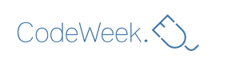

# CodeWeek: Programación

# ¿Quieres aprender o enseñar a programar ?

José Antonio Vacas @javacasm

[elCacharreo.com](http://blog.elcacharreo.com)

* * *

## Esta semana se celebra la Semana Europea del Código

### [¿qué es programar?](./presentacion.md)

### [¿Cómo se programa?](./presentacion.md#empezamos)

### [Ejemplos "Scractch"](./ejemplos_snap.md)

### [Android](./android.md)

### [Cursos abiertos y gratuitos](./cursos_calidad.md)

### [Detalles técnicos](./tecnico.md)

### [ToDo](./todo.md)