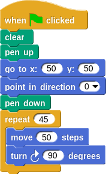

# Tutorial de Snap (Scratch)

José Antonio Vacas @javacasm

[elCacharreo.com](http://blog.elcacharreo.com)

* * *

### Es un sistema pensado para ser muy adaptable

### Por eso tenemos que dar todos los pasos

### Tendremos que decir cuando usamos el lapiz y donde empezamos a dibujar

* * *

## Cuadrado

### Vamos a dibujar un cuadrado

### Tenemos claros los pasos:
	1. Línea
	2. Giro
	3. Línea
	4. Giro
	5. Línea
	6. Giro
	7. Línea
	8. Giro

### ¡¡Pero podemos hacerlo más fácil
	Vamos a repetir 4 veces:
		1. Línea
		2. Giro

* * *

### ¿ Y si hacemos más de 4 giros?

### ¿Y si repetimos muchos cuadrados?

