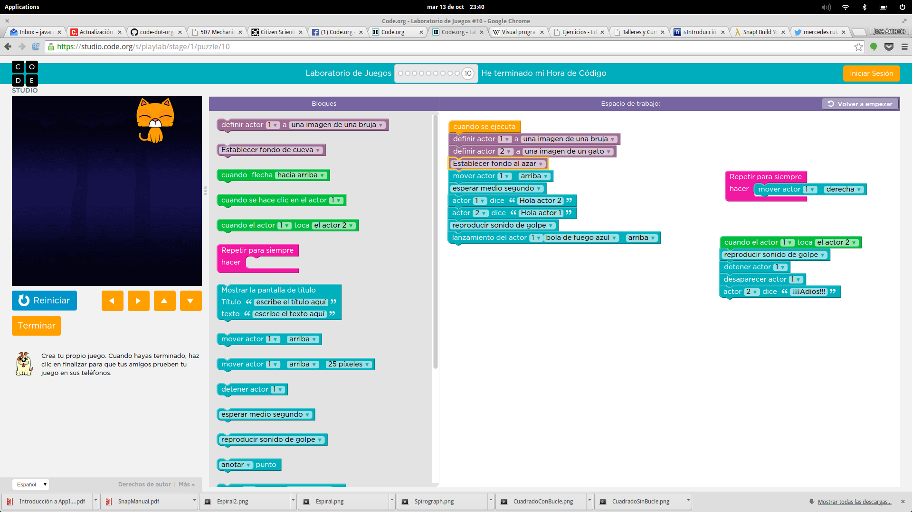

# Programación

José Antonio Vacas @javacasm

[elCacharreo.com](http://blog.elcacharreo.com)

* * *

### ¿qué es programar?

### ¿sabéis programar?

### ¿habéis programado?

### ¿para qué sirve?

	* Capacidad de razonamiento
	* Enseña a resolver problemas
	* Capacidad analítica
	* Concentración

* * *
## Un pequeño paréntesis 

#### ¿Qué significa CC? 
#####  Licencias
#####  ¿por qué?
#####  ¿Compartir?

### ¿Por qué me gusta esta forma de funcionar?

	### Porque puedo hacer las cosas por mi mismo, cuando las entiendo, las puedo modificar y adaptarlas

### Ejemplo: [Arduino](http://www.arduino.cc)

### Ejemplo: impresoras 3D
Imágenes, diseños, electrónica, programas

* * *

## ¡¡¡Empezamos!!!

### code.org

#### ¿no son todos .com?

#### ¿quién está detrás?

* * * 
### Vamos a hacer pequeños programas para ayudar a nuestros amigos

### ¿Frozen? ¿Angry birds? ¿Flappy bird?

[nivel 1](https://studio.code.org/hoc/1/	)

* * * 

## Juegos

### Veamos algo más complejo

[juego code.org](https://studio.code.org/s/playlab/stage/1/puzzle/10)

### Aplicaciones más complicadas: snap

[scratch](http://snap.berkeley.edu/snapsource/snap.html)

