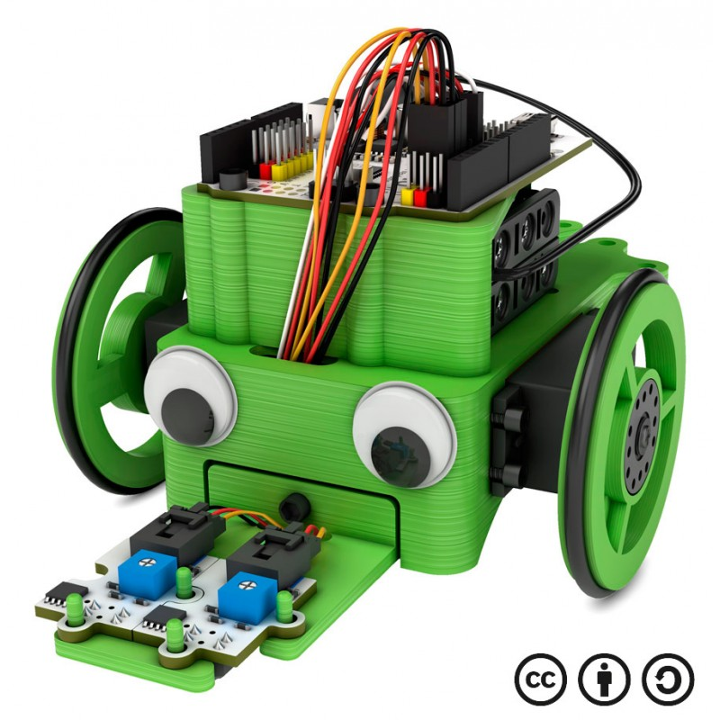
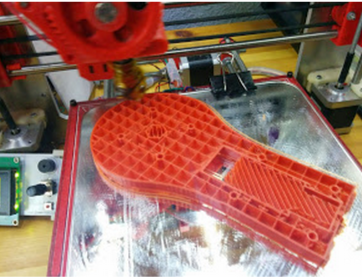
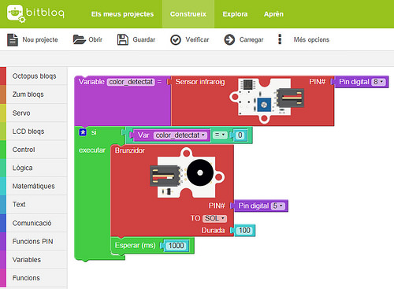

# Robots

José Antonio Vacas @javacasm

[elCacharreo.com](http://blog.elcacharreo.com)

* * *

## Robot = mecánica+electrónica+programación

### printbot

#### Robot que usa piezas impresas en 3D

## bitbloq

[bitbloq](http://bitbloq.bq.com/)